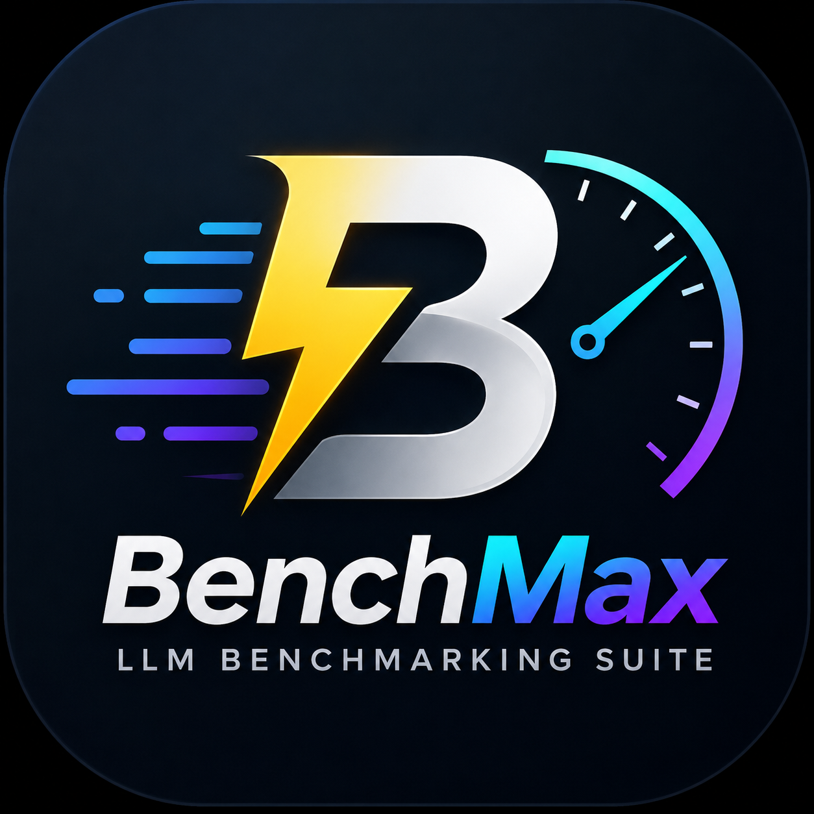
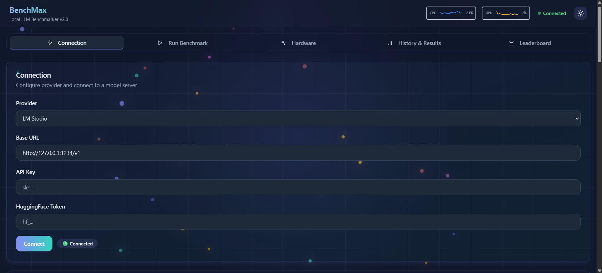
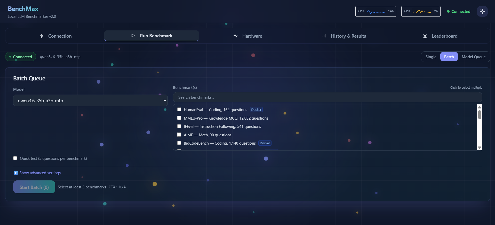
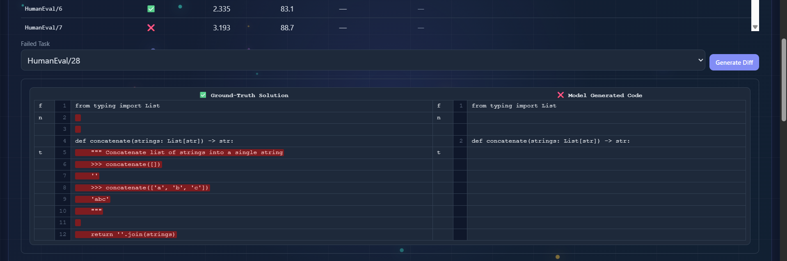
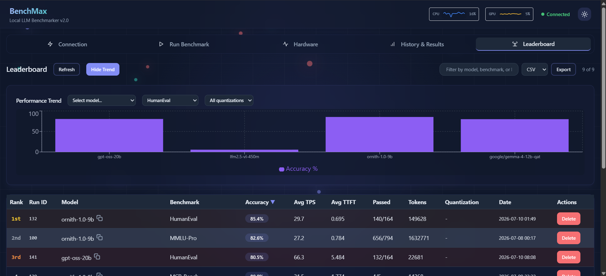

<div align="center">

# BenchMax

### Local LLM Benchmarking Suite
**Evaluate any LLM against 21 standardized benchmarks — works with LM Studio, OpenAI, Ollama, and more.**

<br>


<br><br>


</div>

---

<p align="center">
  
</p>

## Overview

BenchMax is a **free and open-source** LLM benchmarking platform under the **AGPL v3** license. Point it at any OpenAI-compatible API endpoint (local or cloud), select a benchmark, and get standardized scores across code generation, math reasoning, instruction following, function calling, safety, vision, and long-context tasks.

Created by [**Rando**](https://github.com/7amzaRando).

---

## Screenshots (v1.0)

<p align="center">
  <strong>Connection Tab</strong><br>
  
</p>

<p align="center">
  <strong>Run Benchmark Tab</strong><br>
  
</p>

<p align="center">
  <strong>Hardware Monitor Tab</strong><br>
  
</p>

<p align="center">
  <strong>History & Results — Diff Viewer</strong><br>
  
</p>

<p align="center">
  <strong>History & Results — Charts & Stats</strong><br>
  
</p>

<p align="center">
  <strong>Leaderboard Tab</strong><br>
  
</p>

---

## Features

<table>
<tr>
<td width="50%">

#### 21 Benchmarks
HumanEval · MMLU-Pro · IFEval · AIME · BigCodeBench · BFCL · MCP-Bench · Safety · Aider Polyglot · LongBench-v2 · MMMU-Pro · LiveBench · BenchMax Personal · BenchMax Lite · BenchMax Code · BenchMax Reason · BenchMax Tectonic · Writing Speed Test · Coding Speed Test · TruthfulQA

</td>
<td width="50%">

#### 8 API Providers
LM Studio · Ollama · OpenAI · OpenRouter · Groq · DeepSeek · AIMLAPI · SiliconFlow — any OpenAI-compatible endpoint

</td>
</tr>
<tr>
<td width="50%">

#### Live Inference Metrics
TTFT, TPS, per-sample timing, token counts — streamed in real time via 3s polling

</td>
<td width="50%">

#### Hardware Telemetry
CPU, RAM, GPU load, VRAM, temperature — NVIDIA & AMD (typeperf-based, 0.3s per cycle)

</td>
</tr>
<tr>
<td width="50%">

#### Docker Sandbox
Isolated code execution in 6 language-specific containers (`benchmax-python/node/java/gcc/go/rust`, ~1–2GB each, pre-installed deps, network-disabled, 128MB RAM, 1 CPU) with live build streaming

</td>
<td width="50%">

#### Batch & Model Queue
Run multiple benchmarks or multiple models in sequence with live ETA, accuracy comparison, and automatic load/unload

</td>
</tr>
<tr>
<td width="50%">

#### Full Lifecycle Control
Pause, resume, or halt any run or queue — state persisted to SQLite, resumes from exact position

</td>
<td width="50%">

#### Quick Test Mode
Run any benchmark on a 5-sample mini dataset for rapid iteration

</td>
</tr>
<tr>
<td width="50%">

#### Multimodal Vision
MMMU-Pro sends images to vision models via the API (base64 PNG, 1,200 samples)

</td>
<td width="50%">

#### On-Demand Datasets
Download full benchmark datasets from the UI — no manual fetching required

</td>
</tr>
<tr>
<td width="50%">

#### Online Leaderboard
Sync results to the public leaderboard and compare with the community

</td>
<td width="50%">

#### Standalone .EXE
Build a single-file executable via PyInstaller (~84MB, no Python environment needed)

</td>
</tr>
<tr>
<td width="50%">

#### Anti-Loop Protection
Three-strategy repetition detection (exact substring, SequenceMatcher adjacency, fragment counting) prevents runaway model output

</td>
<td width="50%">

#### Temperature Toggle
Optionally omit temperature to use the provider's default, or set a custom value

</td>
</tr>
</table>

---

## Benchmarks

| Benchmark | Category | Docker | Samples | Type |
|---|---|---|---|---|
| **HumanEval** | Code generation | ✅ | 164 | Python function completion |
| **MMLU-Pro** | Knowledge MCQ | — | 12,032 | 10-option multiple choice |
| **IFEval** | Instruction following | — | 541 | 25+ rule-based checkers |
| **AIME** | Math reasoning | — | 90 | Integer answer (0–999) |
| **BigCodeBench** | Code generation | ✅ | 1,140 | Library-heavy coding (99.3% coverage) |
| **BigCodeBench-Hard** | Code generation | ✅ | 148 | Hard subset |
| **BFCL** | Function calling | — | 4,696 | AST-based JSON scoring |
| **MCP-Bench** | MCP tool selection | — | 104 | Server + tool name matching |
| **Safety** | Refusal behaviour | — | 450 | UncensorBench + OR-Bench |
| **Aider Polyglot** | Code editing | ✅* | 225 | 6 languages (Python/JS/Java/Go/Rust/C++) |
| **LongBench-v2** | Long-context QA | — | 503 | 32K–128K token contexts |
| **MMMU-Pro** | Multimodal vision | — | 1,200 | Image + text MCQ w/ base64 PNG |
| **LiveBench** | Meta-benchmark | ✅^ | 1,436 | 6 categories |
| **BenchMax Personal** | Composite BMS | — | 100 | 5-dimension weighted score (BMS out of 100) |
| **BenchMax Lite** | All-round | — | 50 | 4 dimensions — Code/Knowledge/Math/Logic |
| **BenchMax Code** | Coding | — | 100 | 4 categories — Algorithms/Data Structures/Strings/Math |
| **BenchMax Reason** | Reasoning | — | 100 | Math/Logic Puzzles/Data Analysis/Scientific Reason |
| **BenchMax Tectonic** | Multi-category | — | 300 | Coding/Logic/Instruction/Knowledge/Tool Calling |
| **Writing Speed Test** | Creative writing & RP | — | 5 | ~300 tokens per prompt |
| **Coding Speed Test** | Code generation speed | — | 5 | ~300 tokens per prompt |
| **TruthfulQA** | Truthfulness MCQ | — | 817 | A/B multiple choice |

<sub>\* Python uses local unittest; JS/Java/Go/Rust/C++ use Docker. ^ Coding category via Docker; other 5 are MCQ/text-based.</sub>

---

## Dashboard Tabs

| Tab | What it does |
|---|---|
| **Connection** | API provider presets + endpoint config + API key + Docker status + dataset installer |
| **Run Benchmark** | Single-run, batch queue, or model queue with progress bar, ETA, live token stats |
| **Hardware** | Real-time CPU/RAM gauges + GPU/VRAM/temperature at 3s intervals (pause-able) |
| **History & Results** | Past runs, diff viewer, CSV/JSON export, batch comparison, token analysis, per-sample results, latency/TTFT/token distribution charts |
| **Leaderboard** | Local completed runs with sort/filter/delete + online leaderboard sync + model trend chart |

---

## Requirements

- **Python 3.11+** (for source builds) — or download the standalone .exe
- **An API endpoint** — LM Studio (`localhost:1234`), OpenAI, Ollama, Groq, etc.
- **Docker Desktop** (required for code-generation benchmarks: HumanEval, BigCodeBench, Aider Polyglot, LiveBench coding)

---

## Quick Start

### Source Build

```powershell
git clone https://github.com/7amzaRando/BenchMax.git
cd BenchMax
python -m venv .venv
.venv\Scripts\pip install -r backend\requirements.txt
.venv\Scripts\uvicorn backend.main:app --reload --host 0.0.0.0 --port 8000
```

### Build Local Docker Images (for code benchmarks)

```powershell
# In the UI: Connection tab → "Build Local Images" button
# Or via script:
.venv\Scripts\python scripts\build_docker_images.py
```

### Standalone .EXE

```powershell
.\build.bat
# Output: dist\BenchMax.exe (~84MB, no Python needed)
```

Open **http://localhost:8000** in your browser. Connect to your API provider and start benchmarking.

---

## Architecture

```
Browser → http://localhost:8000
            │
            ▼
       FastAPI (backend/main.py)
         ├── GET /api/health
         ├── SPA serve at "/" → React frontend (frontend/dist/)
         └── REST API at /api/* → api.py → operations.py
               │
     ┌─────────┼──────────────┐
     ▼         ▼              ▼
LM Studio   SQLite        Docker
:1234/v1    records/      benchmax-*
(httpx      benchmax.db   network-disabled,
streaming)  (SQLAlchemy)  128MB, 1CPU, --rm)
```

**Data flow:** User clicks Start → React POSTs `/api/run/start` → `trigger_run()` creates `Run` row (PENDING) → daemon thread calls `bench.run_evaluation()` → for each sample: check Run.status → `_check_repetition()` on client → `LMStudioClient.generate_completion()` → extract code → `DockerExecutor.execute_python_code()` (for code benchmarks) → write `Result` row → increment `Run.current_index`. React polls `/api/run/{id}/status` every 3s → renders UI.

**Anti-loop Protection:** Three-layer detection (v2 — reliable). **Client** (`_check_repetition()`): (A) 200-char exact tail-in-body substring match, (B) adjacent SequenceMatcher(autojunk=False, ≥0.95), (C) 80-char fragment counting (≥5 occurrences). Stream aborted immediately via `break`. **Benchmark loop**: writes failed Result, increments index, continues. **UI**: poll injects "Repetition detected" warning.

---

## Tech Stack

| Technology | Role |
|---|---|
| Python 3.11 | Backend logic and inference orchestration |
| FastAPI | REST API (30+ endpoints: runs, batches, telemetry, export, leaderboard) |
| React 19 + TypeScript | Dashboard UI (5 tabs, dark mode, real-time Recharts) |
| Vite | Frontend build tool |
| SQLAlchemy + SQLite | Run state, results, batch persistence (WAL mode) |
| OpenAI-compatible API | Local + cloud inference (streaming, vision) |
| Docker | 6 language-specific images for isolated code execution |
| psutil + GPUtil + typeperf | Hardware telemetry (CPU, RAM, GPU, VRAM, NVIDIA + AMD) |

---

## License

Copyright (C) 2026 [Rando](https://github.com/7amzaRando)

This program is free software: you can redistribute it and/or modify it under the terms of the **GNU Affero General Public License** as published by the Free Software Foundation, either version 3 of the License, or (at your option) any later version.

### Commercial License

If the AGPL v3 does not meet your needs, a **commercial license** is available. Contact [Rando](https://github.com/7amzaRando) for terms.

---

## Contact

**Author:** [Rando](https://github.com/7amzaRando)  
**Sponsorship / Commercial Inquiries:** Reach out via GitHub

---

<div align="center">

**BenchMax** · [AGPL v3](LICENSE) · © 2026 Rando

</div>
