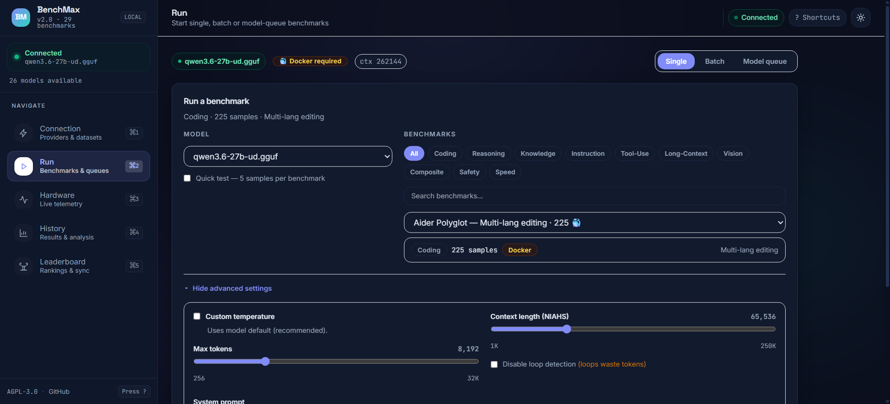
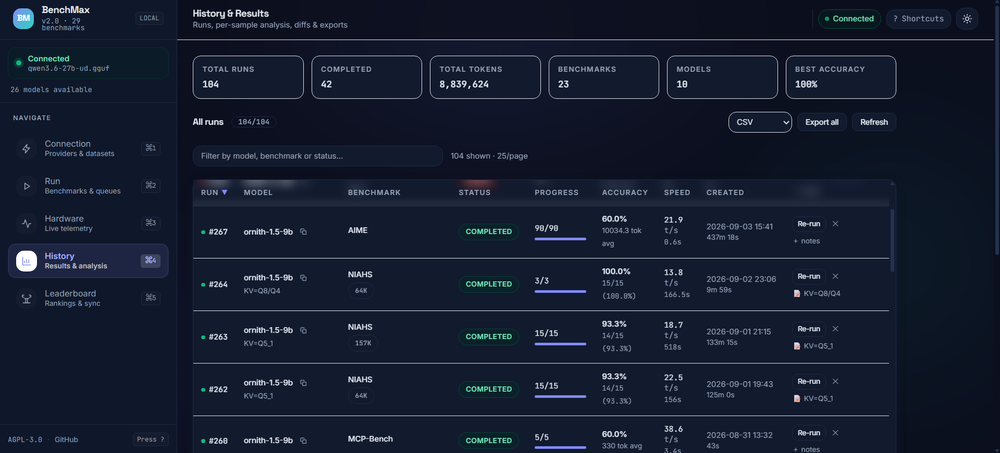
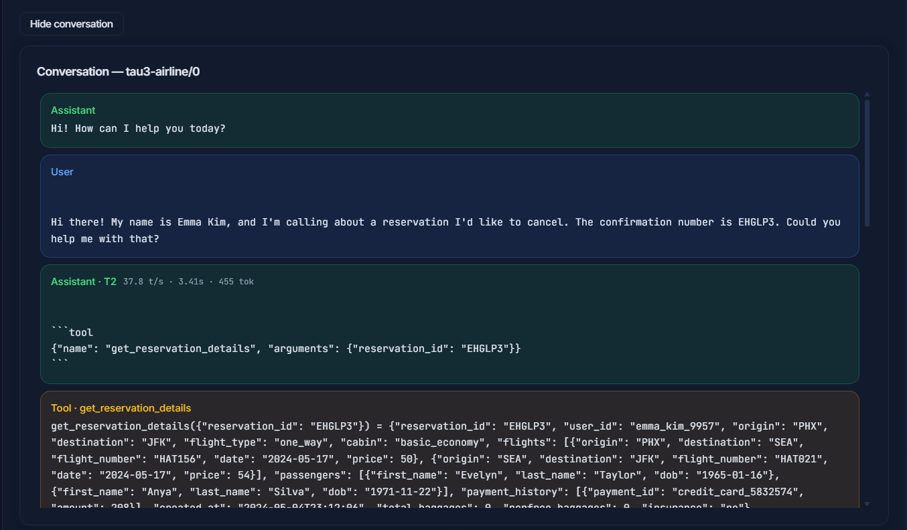
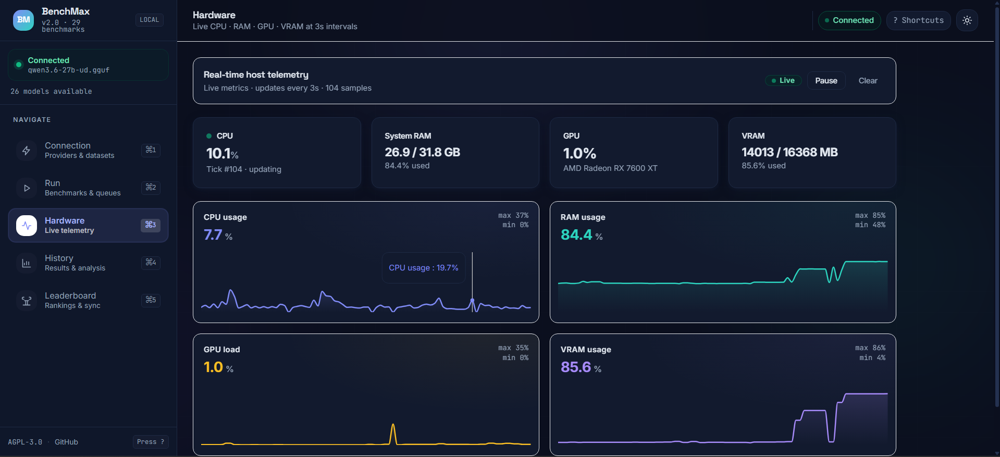

# BenchMax

**Local LLM Benchmarking Suite** — Score any LLM on 30 standardized benchmarks. Works with LM Studio, Ollama, OpenAI, and any OpenAI-compatible endpoint.

**[Official Site](https://7amzarando.github.io/BenchMax/)** · [Docs](https://7amzarando.github.io/BenchMax/docs/) · [GitHub](https://github.com/7amzaRando/BenchMax)

[](https://www.python.org/)
[](https://fastapi.tiangolo.com/)
[](https://react.dev/)
[](LICENSE)
[](https://github.com/7amzaRando/BenchMax/actions/workflows/ci.yml)

---

## Why BenchMax

- **Full eval suite, one click** — code, math, reasoning, knowledge, instruction following, function calling, safety, vision, long-context, and agentic tool-use tasks.
- **Runs entirely on your machine** — results stay local in SQLite, no cloud account needed. Only the 5 code benchmarks need Docker; the other 25 run with zero setup.
- **Live speed metrics** — time-to-first-token, tokens/sec, and CPU/RAM/GPU telemetry stream into the dashboard while a run is in progress.
- **Built for comparing models** — batch queues, multi-model load/unload queues, pause/resume from the exact sample, head-to-head charts, and a community leaderboard.
- **Free and open source** (AGPL v3) by [**Rando**](https://github.com/7amzaRando).

---

## Screenshots






---

## Quick Start

Requires Python 3.11+ and Node.js 18+ (for the one-time frontend build).

```powershell
git clone https://github.com/7amzaRando/BenchMax.git
cd BenchMax
python -m venv .venv
.venv\Scripts\pip install -r backend\requirements.txt
cd frontend
npm install; npm run build
cd ..
.\run.bat
```

Open **http://localhost:8000**, connect to your provider (LM Studio, Ollama, OpenAI, …), pick a benchmark, and press Start.

Prefer a standalone app? `.\build.bat` produces `dist\BenchMax.exe` (no Python needed). Code benchmarks need Docker Desktop plus one click on **Build Docker Image** in the Connection tab.

---

## Benchmarks

30 benchmarks across code generation, math, reasoning, knowledge, instruction following, tool calling, safety, vision, long context, and agentic tasks — including HumanEval, MMLU-Pro (12k questions), IFEval, BFCL (4.7k function calls), HellaSWAG (10k), and multi-turn agents like GAIA and Tau3-Airline.

Full list with sample counts and scoring methods: **[docs/BENCHMARKS.md](docs/BENCHMARKS.md)**.

---

## What you get

| Tab | What it does |
|-----|-------------|
| **Connection** | Provider presets, endpoint config, dataset installer |
| **Run Benchmark** | Single, batch, or multi-model runs with progress bar, ETA, live token stats |
| **Hardware** | Real-time CPU/RAM/GPU/VRAM gauges (pausable) |
| **History & Results** | Past runs, answer diffs, exports, comparison and latency charts |
| **Leaderboard** | Local rankings plus optional online sync |

Scripting and agents: a 38-command CLI (`py cli.py run --model M --benchmark HumanEval --wait`) and a 45-endpoint REST API with Swagger UI at `/docs`. Details: **[docs/API.md](docs/API.md)**.

---

## Architecture

```
Browser → http://localhost:8000 → FastAPI → LM Studio / any OpenAI-compatible API
                                     ├── SQLite (runs, results, batches)
                                     └── Docker sandbox (code benchmarks only)
```

---

## Docs

| Doc | Contents |
|-----|----------|
| [docs/BENCHMARKS.md](docs/BENCHMARKS.md) | Every benchmark: categories, sample counts, scoring |
| [docs/API.md](docs/API.md) | REST endpoints, request schemas, CLI reference |
| [docs/CONFIGURATION.md](docs/CONFIGURATION.md) | Requirements, env vars, Docker setup |
| [docs/TROUBLESHOOTING.md](docs/TROUBLESHOOTING.md) | Common errors and fixes |
| [docs/AGENT_GUIDE.md](docs/AGENT_GUIDE.md) | CLI workflows for AI agents |

---

## License

Copyright (C) 2026 [Rando](https://github.com/7amzaRando) — **GNU AGPL v3** (see [LICENSE](LICENSE)). A commercial license is available on request; sponsorship and commercial inquiries via GitHub.
